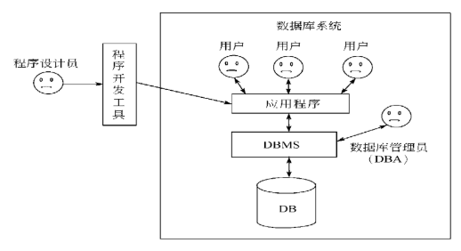

## 数据库概述

### 1.数据库：database(DB)
#### 数据库是存放数据的仓库，而且这些数据存在一定的关联，并按一定的格式存放在计算机上。数据包括数字，文本，图像，音频，视频。
- 1）数据库可以根据数据结构组织，存储和管理数据
- 2）数据库能够长期，高效的管理和存储数据
- 3）数据库的目的是安全，高效地存储和提供数据

### 2.数据库管理系统：Database Management System(DBMS)
#### DBMS是指一个操作和管理数据库的软件，DBMS应提供如下功能：
- 1）数据定义功能：可以定义数据库中的数据对象
- 2）数据操纵功能：可以对数据库表进行基本操作，比如插入，删除，修改，查询等等
- 3）数据的完整性检查功能：保证用户输入的数据满足相应的约束条件
- 4）数据库的安全保护功能：保证只有具有权限用户才能访问数据库中的数据
- 5）数据库的并发控制功能：使多个应用程序可在同一时刻并发的访问数据库的数据
- 6）数据库系统的故障恢复功能：使数据库在运行出现故障时进行数据库恢复
- 7）在网络环境下访问数据库的功能
- 8）方便，有效的存储数据库信息的接口和工具 

### 3.数据库类型
#### 关系型数据库：建立在关系模型基础上的数据库。Oracle,DB2,SQL Server,MySQL等
- 关系模型指的就是二维表格模型，而一个关系型数据库就是由二维表及其之间的联系所组成的一个数据组织
- 关系型数据库的优点：容易理解、使用方便、易于维护
- 关系型数据库不足：性能欠佳、不适合互联网非结构化数据存储
#### 非关系型数据库：NoSQL数据库，是一种数据结构化存储方法的集合
- 非关系型数据库以键值对存储，且结构不固定，每一个元组可以有不一样的字段，每个元组可以根据需要增加一些自己的键值对，不局限于固定的结构，可以减少一些时间和空间的开销

### 4.数据库系统 Database System(DBS)
- 数据，数据库，数据库管理系统与操作数据库的应用程序，加上支撑它们的硬件平台，软件平台和与数据库有关的人员构成了一个完整的数据库系统。
- 

### 5.SQL分类(SQL-结构化查询语言)
- 1、数据查询语言(DQL) select
- 2、数据操纵语言(DML) insert、delete、update (表数据)
- 3、数据定义语言(DDL) create、drop、 alter (表结构) 

### 补充
- 导入数据：source 数据文件路径
