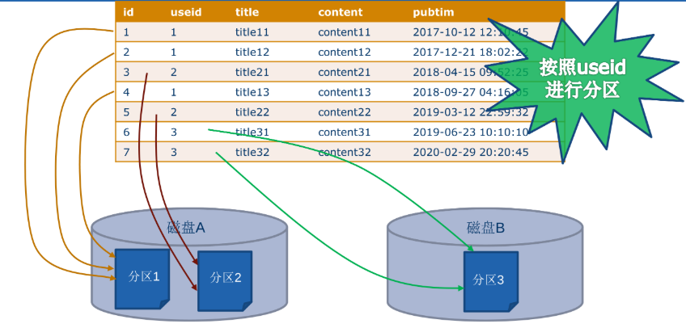
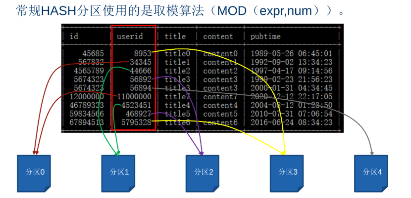

## 分区
>一、分区概论
- 表分区就是将一个大表按照MySQL提供的几种方式，分成几个小表。

- 如果一个表的数据量太大，不仅查找数据的效率低，而且难以找到一块集中的存储空间来存放。通过分区可以在物理层面将一个表分割成许多个小块进行存储，这样我们在查找数据时，就不需要进行全表查找了，只需要知道这条数据所在的块号，然后根据块号直接定位相应的快进行查找即可。分区也可以将数据分配到不同的磁盘中，以解决一块磁盘放不下整个表的问题。

>二、MySQL分区的优点与不足

    |优点|不足|
    |:---:|:---:|
    |可以存储更多的数据|一个表最多只能有1024个分区|
    |优化查询|在MySQL5.1之后才支持分区|
    |对于不需要的数据可以通过删除区块快速删除|MySQL5.1只支持整型表达式进行分区 , MySQL5.5之后可以支持其他类型表达式进行分区，也不是所有类型
    |跨多个磁盘来分散数据查询，可获得更大的查询吞吐量|分区表无法使用外键约束|

>三、分区的原理及功能



>四、分区类型
- 1、range分区，是一个基于给定连续时间区间范围，把记录分配到不同的分区

- 2、list分区，与range分区类似，区别在于list分区基于列值匹配一个离散值集合的某个值来进行分区。

- 3、hash分区，是基于用户定义的表达式返回值来选择分区，该表达式要插入到表中的列值进行哈希计算(hash计算)。

- 4、key分区，与hash分区类似，但是hash分区允许用户使用自定义表达式，而key分区不允许，它需要使用MySQL提供的hash函数，同时hash分区只支持整型类型，而key分区支持除了blob和text类型外的其他类型。

>五、分区

>>(一)range分区
- range分区即范围分区，根据区间来判断位于哪个分区。这些分区要连续不能相互重叠，可以使用values less than操作符进行定义。range分区只能匹配整型列或表达式分区。
```
create table tb_range_blog(
id bigint unsigned,
userid int unsigned,
title varchar(255),
content text,
pubtime datetime)
partition by range (userid) (
partition part1 values less than(5000000),
partition part2 values less than(10000000),
partition part3 values less than(15000000),
partition part4 values less than(maxvalue));
```
```
alter table tb_range_blog
partition part1 values less than(2000),
partition part2 values less than(2010),
partition part3 values less than(2020),
partition part4 values less than(maxvalue));
```
- 执行包含分区键的查询，MySQL可以迅速的定位需要扫描的分区，而不需要全表搜索，从而大大提高查询效率。
```
select count(*)日志数 from tb_range_blog
where year(pubtime)<1998;
此查询只需要遍历2000年前的记录所以只扫描part1.
```

- 当需要删除一个分区的“所有旧的”数据时，只需要删除分区即可。
```
alter table tb_range_blog
drop partition part1;
```

- range columns分区，MySQL5.5改进了range分区功能，提供了range columns分区，range columns不接受表达式，只能是列名；range columns支持多列分区；range columns不限于整数对象，date、datetime、string都可作为分区列。
```
create table tb_rangecolumn_blog(
id bigint unsigned,
userid int unsigned,
title varchar(255),
content text,
pubtime datetime)
partition by range columns(pubtime) (
paetition part1 values less than ('2000-01-01'),
paetition part1 values less than ('2010-01-01'),
paetition part1 values less than ('2020-01-01'),
paetition part1 values less than (maxvalue));
```

- 多列分区表案列
```
create table tb_emp(
id int,
ename varchar(10) not null,
hiredate date,
esex char(2) default'男',
sal int default null,
job varchar(30) not null default'程序员',
deptno char(4))
partition by range columns(esex,hiredate)(
partition p1 values less than("男",'2010-01-01'),
partition p2 values less than("男",'2020-01-01'),
partition p3 values less than("男",maxvalue),
partition p4 values less than("女",'2010-01-01'),
partition p5 values less than("女",'2020-01-01'),
partition p6 values less than("女",maxvalue),
partition p7 values less than(maxvalue,maxvalue));

第一个分区用于存储员工表2010年之前入职的男员工，第二个分区用于存储员工表2010-2019年入职的男员工，第三个分区用于其他的男员工，第四到第六个分区用于存储女员工信息的，最后一个分区是存放意想不到的情况的。
```
>>(二)list分区

- list分区是基于列值匹配一个离散值集合中的某个值来进行分区。list分区通过使用partiton by list(expr)来实现，其中"expr"是某列值或基于某列值返回一个整数值的表达式，然后通过"values in (value_list)"的方式来定义每个分区。
- MySQL5.1中，只能匹配整型列表。
- MySQL5.5后支持非整型列分区。
```
create table tb_list_blog(
id bigint unsigned,
userid int unsigned,
title varchar(255),
content text,
pubtime datetime)
partition by list(month(pubtime)) (
partition part1 values in(1,3,4),
partition part2 values in(2,5,6),
partition part3 values in(null,7,8,9),
partition part4 values in(10,11,12));
```

>>(四)hash分区
- hash分区是基于用户定义的表达式返回值进行选择的分区，该表达式使用将要插入表中的列值进行计算。这个表达式需要长生非负整数。

- 使用hash分区来分割一个表，则应在create table语句上添加"partition by hash(expr)"语句，其中"expr"是一个返回一个整数的表达式。此外，在后面再添加"partitions num"子句，其中num也是一个非负的整数，它表示表将被分割成分区的数量。如果没有包含"partitions num"子句，那么分区的数量会默认为1.

- hash分区的优点在于数据分布均匀。

- hash分区案例
```
create table tb_hash_blog(
id bigint unsigned,
userid int unsigned,
title varchar(255),
content text,
pubtime datetime)
partition by hash(userid) partition 5;

tb_hash_blog表采用了hash分区，用于分区的表达式为非负字段userid,一共分为了五个分区。
```

- hash分区原理



>>(五)key分区
- key分区类似hash分区，区别在于以下几点：
- 1、key分区允许多列，而hash分区只允许一列。

- 2、如果主键或唯一键的情况下，key分区列可不指定，默认为主键或唯一键，如果没有主键或唯一键，则必须显性指定列。

- 3、key分区对象必须为列，而不能是基于列的表达式。
- 4、key分区和hash分区的算法不一样。

-key分区案例
- tb_key_blog表采用了key分区，用于分区的列为id，一共分为了3个分区。如果tb_key_blog没有主键或唯一键时，必须显示指定分区列id。如果tb_key_blog定义了主键时，key分区列可不指定，默认为主键id。但是如果当一个表有主键或唯一键时，key分区必须为主键或唯一键。
```
create table tb_key_blog(
id bigint unsigned,
userid int unsigned,
title varchar(255),
content text,
pubtime datetime )
partition by key(id) partitions 3; 
```

```
create table tb_key_blog(
id bigint unsigned primary key,
userid int unsigned,
title varchar(255),
content text,
pubtime datetime )
partition by key() partitions 3; 
```

