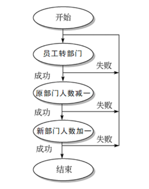

## 事务
>事务的概念
- 在MySQL环境中，事务作为独立单元由一条或多条SQL语句组成。这个单元格中的每条SQL语句是相互依赖的，而且单元作为一个整体是不可分割的。如果单元中的一条语句不能完成，整个单元就会回滚，所有影响到的数据将返回到事务开始以前的状态。因而，只有事务中的所有语句都成功地执行才能说明这个事务被成功地执行。
- 例如：将公司的一名员工从一个部门转到另一个部门  

>事务的四大特性
>> 1.原子性
- 原子性意味着每个事务都必须被看作是一个不可分割的单元。假设一个事务由两个或多个任务组成，其中的语句必须同时成功才能认为整个事务是成功的。如果事务失败，系统将会返回到该事务以前的状态。
- 在员工转部门这个例子中，原子性指如果没有实现将部门表中原部门人数减一或新部门加一，就不可能将一个员工转部门。
>>2.一致性
- 一致性是指事务必须使数据库从一个一致性状态变换到另一个一致性状态，也就是说一个事务在执行之前和执行之后都必须处于一致性的状态。参照前面的例子，一致性是指如果员工转部门不成功，那部门人数不能发送改变，要保证数据的一致性
>>3.隔离性
- 隔离性是指每个事务在它自己的空间发生，和其他发生在系统中的事务隔离，而且事务的结果只有在它完全被执行时才能看到。即使在这样的一个系统中同时发生了多个事务，隔离性原则保证某个特定事务在完全完成之前，其结果是看不见的。对于任意两个并发的事务S1和S2来说，在事务S2要么在事务S1开始之前就已经结束，要么在事务S1之后才开始，这样每个事务都感觉不到有其他事务在并发执行。
>>4.持久性
- 持久性是指即使系统崩溃，一个提交的事务仍然存在。当一个事务完成，数据库的日志已经被更新时，持久性就开始发生作用。大多数RDBMS产品通过保存所有行为的日志来保证数据的持久性，这些行为是指在数据库中任何方法更改数据。数据库日志记录了所有对于表的更新、查询、报表等操作。