## 学生成绩数据库查询3 +事务   
>一、实验目的

使用select命令实现学生成绩系统的聚合函数、分组查询、连接查询操作。

>>表字段说明：

- 在学生表tb_student中，sno 为学号，sname为姓名，ssex为性别，sage为年龄，classname为所在班级，edate入学日期，tel为手机号码
- 在课程表tb_course中cno为课程号，cname为课程名,credit为学分，cours为任课时
- 在选课表tb_mark中 sno为学号，cno为选课的课程号，grade为选课的成绩

>二、实验要求
- 1.统计出课程表中的总学分（学分和），最大学分、最小学分、平均学分及课程的个数，所有的通过聚合函数统计出的字段都给出相应的别名。
```
    select sum(credit) 总学分,max(credit) 最大学分,
    min(credit) 最小学分,avg(credit) 平均学分,count(cno) 课程个数
    from tb_course;
```
- 2.统计出“19软件5班”学生所有成绩的总分及平均分。
```
    select sum(grade)总分,avg(grade)平均分 from tb_mark 
    where sno in(select sno from tb_student where classname="19软件5班");
```
- 3.统计出cno为“c002”课程的参加考试人数、最高分、最低分及平均分。
```
    select count(grade)参加考试人数,max(grade) 最高分,mi(grade) 最低分,avg(grade) 平均分 
    from tb_mark where cno="c002";
```
- 4.统计出每个班学生的平均年龄，显示出平均年龄大于20岁的班级名称及平均年龄。
```
    select classname,avg(sage) 平均年龄 from tb_student 
    where classname is not null
    group by classname
    having avg(sage)>20;
```
- 5.统计出每个年级男女生（性别）的人数、平均年龄、最大年龄。（学生是哪个年级可以通过入学日期的年份进行判断。通过year（edate）可以获得入学日期年份）
```
    select year(edate)年级,ssex 性别 ,count(*) 人数 ,avg(sage) 平均年龄,max(sage) 最大年龄
    from tb_student 
    where edate is not null
    group by year(edate),ssex;

```
- 6.查询出具体的选课情况，罗列学号、姓名、性别、课程号、课程名、学分、成绩。
```
    select tb_mark.sno 学号,sname 姓名,ssex 性别,tb_mark.cno 课程号,credit 学分,grade 成绩
    from tb_mark join tb_student join tb_course 
    on tb_mark.sno=tb_student.sno and tb_mark.cno=tb_course.cno;
```
- 7.查询出每门课程的的最高分，罗列出课程号、课程名及最高分。
```
    SELECT tb_mark.cno 课程号,cname 课程名,MAX(grade) 最高分
    FROM tb_mark  JOIN tb_course  
    ON tb_mark.cno=tb_course.cno
    GROUP BY tb_mark.cno;
```
- 8.查询出每门课程的选修情况，罗列出课程号、课程名、选课学生姓名及成绩，如果课程没有学生选修也必须出现在查询结果中。
```
    select tb_course.cno,cname,sname 姓名,tb_student.sno 学号,grade
    from tb_course join tb_student LEFT outer JOIN tb_mark
    on tb_student.sno=tb_mark.sno and tb_course.cno=tb_mark.cno;
```
- 9.有关事务的题目：
- a)  关闭Mysql的自动提交设置。

    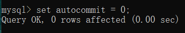
- b)  往学生表添加一条学生记录。（记录内容自己决定）

     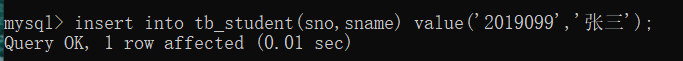
- c)  查询学生表，看看新添加的记录是否出现在学生表中。

     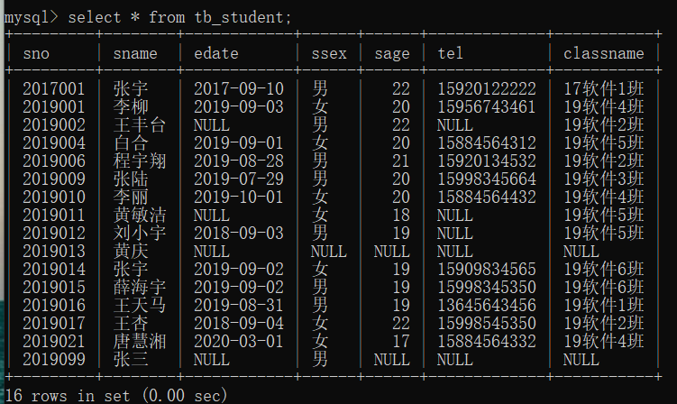
- d)  修改新学生记录的年龄。

     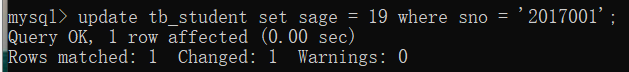
- e)  查询学生表，看看修改操作是否成功。

     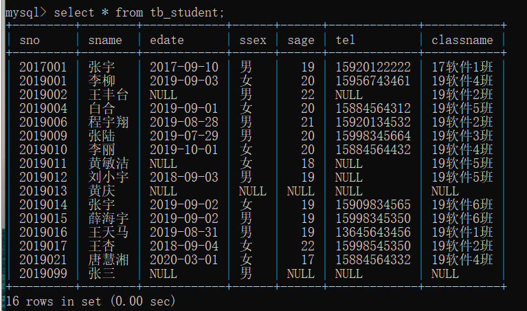
- f)  退出mysql后再重新登录。再次 关闭Mysql的自动提交设置。

- g)  查询学生表，看看刚刚的新添加的记录还在不在。

     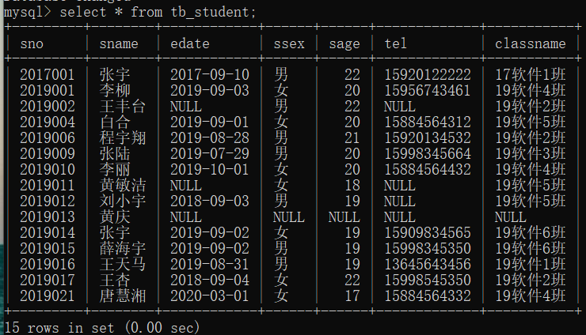

- h)  再往学生表添加一条学生记录。（记录内容自己决定）

    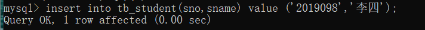
- i)  使用commit进行提交。

     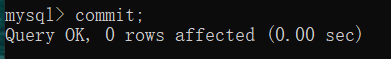

- j)  再往学生表添加一条学生记录。（记录内容自己决定）

     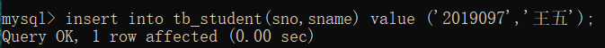
- k)  修改最新学生记录的年龄。

     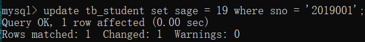
- l)  使用rollback进行回滚。

     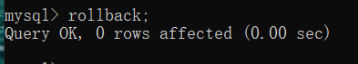
- m)  退出mysql后再重新登录。

- n)  查询学生表，看看哪些新添加的记录在，哪些记录不在了。

     
- o)  打开Mysql的自动提交设置。

    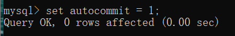
    